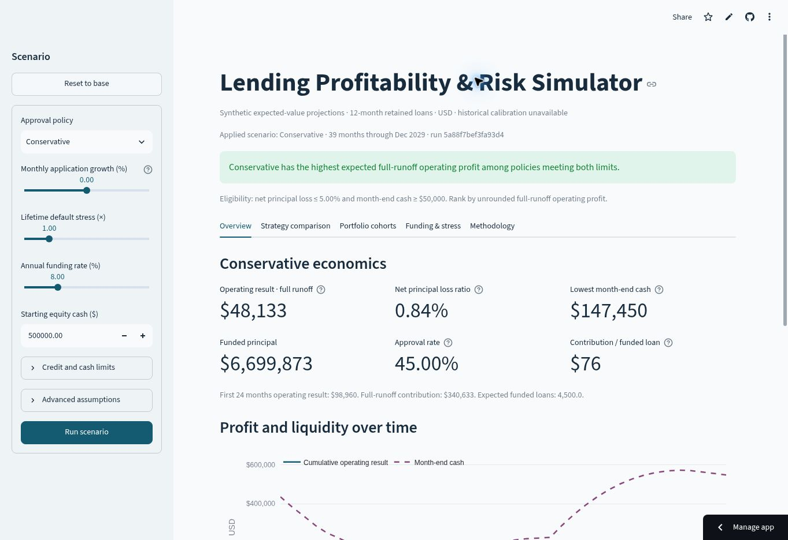

# Lending Profitability & Risk Simulator

Compare how expanding loan approvals changes credit losses, profit, debt use, and cash. A standalone portfolio project for fintech finance and credit/risk analysis, separate from the Financial Underwriting Tool.

The app models a hypothetical lender retaining 12-month merchant-financed installment loans. Its 10,000 applications and risk assumptions are **synthetic and illustrative**. Historical sources provide context only; this is an **uncalibrated expected-value simulator**.

**Live review demo:** [Open the dashboard](https://rishabb-lending-simulator.streamlit.app/) · **Code review:** [Draft PR #1](https://github.com/rishabbshankar226/Lending-Profability-Risk-Simulator/pull/1)



## The decision

Choose the highest full-runoff management operating profit among three policies that meet a net principal loss cap and minimum month-end cash floor. Defaults: 5% net loss and $50,000 cash. No eligible or profitable policy means no profitable recommendation.

With $500,000 starting equity and a $2m facility, the base case demonstrates why profit alone is insufficient:

| Policy | Approval rate | Full-runoff operating profit | Net principal loss | Minimum cash | Eligible |
| --- | ---: | ---: | ---: | ---: | --- |
| Conservative | 45% | $48,133 | 0.84% | $147,450 | Yes |
| Balanced | 80% | $294,468 | 1.58% | −$696,143 | No: cash floor |
| Aggressive | 100% | $396,446 | 2.29% | −$1,485,855 | No: cash floor |

These are conditional modeled results, not observed lender performance. See the [business memo](docs/business-memo.md) and [saved base-case manifest](docs/base-case.json).

## Run locally

Use Python **3.12**. Direct dependency versions were installed and smoke-tested together.

```bash
python -m venv .venv
source .venv/bin/activate
python -m pip install -r requirements-dev.txt
python -m streamlit run app.py
```

On Windows, activate with `.venv\Scripts\activate`. Open the localhost URL printed by Streamlit. The app preloads the dataset and needs no upload, API key, or login.

```bash
python -m pytest
python -m lending_simulator.cli --output artifacts/base-case
python -m scripts.generate_dataset
```

The CLI produces three scenario workbooks, exact-value CSV packages, comparison metadata, and a workbook specification. Regeneration reproduces the committed application CSV and content hash.

The server test starts Streamlit on a temporary local port, checks HTTP health and the frontend document, then stops it. This verifies startup; it does not inspect browser rendering or interactions.

To reproduce downloaded inputs, unzip `manifest.json` and use:

```bash
python -m lending_simulator.cli --assumptions path/to/manifest.json --output artifacts/reproduced
```

## Explore the dashboard

1. **Overview:** selected-policy profit, approvals, loss ratio, and cash.
2. **Strategy comparison:** all three policies on shared demand and assumptions, with eligibility reasons.
3. **Portfolio cohorts:** projected loss by origination month and loan age; future ages remain blank at a cutoff.
4. **Funding & stress:** cash/debt, additional equity, and a default × funding-rate sensitivity grid.
5. **Methodology:** timing, assumptions, sources, financial checks, SQL, and run manifest.

Use **Run scenario** to apply control edits. **Reset to base** restores all assumptions and the cohort cutoff. Downloads always use the applied scenario. Workbook portfolio sheets are saved snapshots; its independent loan and recovery benchmarks contain editable formulas.

## How it works

| Layer | Files | Responsibility |
| --- | --- | --- |
| Dataset | `data.py`, `data/` | Immutable, validated seeded demand and provenance |
| SQL analytics | `analytics.py`, `queries/*.sql` | Correct policy denominators and cohort inputs in integer cents |
| Financial model | `model.py`, `types.py` | Pure expected-value repayment, defaults, recoveries, funding and cash |
| Decisions | `decisions.py` | Exact eligibility, ranking, ties, stress cases and honest empty/loss states |
| Presentation | `presentation.py`, `exports.py`, `app.py` | Charts and downloads from the same result bundle |

Finance uses 34-digit Decimal arithmetic with a $1e−16 internal reconciliation tolerance. Chart values and workbook snapshots use ordinary numeric display precision; CSVs retain exact Decimal strings. The operating view has 24 origination months; the default comparison runs 39 months through complete recovery runoff. No charge-off is subtracted as a second cash payment.

## Review and learn

- [Model specification and assumptions](docs/model-spec.md)
- [Dataset dictionary and SQL walkthrough](docs/data-and-sql.md)
- [Historical source-fitness decision](docs/source-fitness.md)
- [Validation and measured limitations](docs/validation.md)
- [Base-case audit workbook](docs/audit-workbook.xlsx)
- [Interview and 90-second demo walkthrough](docs/walkthrough.md)
- [Hosted review deployment](docs/deployment.md)
- [Live browser results and screenshots](docs/browser-validation.md)
- [Browser and release checklist](docs/release-checklist.md)

All 57 automated model, application-state, export, and HTTP startup checks pass. The hosted desktop build was exercised across all five tabs, scenario apply/reset, capital and stress cases, validation errors, cohort cutoffs, and both downloads. See the browser evidence for tested commits and run IDs. Missing or invalid base data stops the dashboard with a clear error; validated replacements refresh the applied scenario and exports.

The demo runs from the review branch; PR #1 remains unmerged. Anonymous-session and mobile testing, a full accessibility/network audit, hosting load measurements, and the walkthrough video remain pending. The hosting public setting was observed, but an isolated anonymous browser was unavailable.
