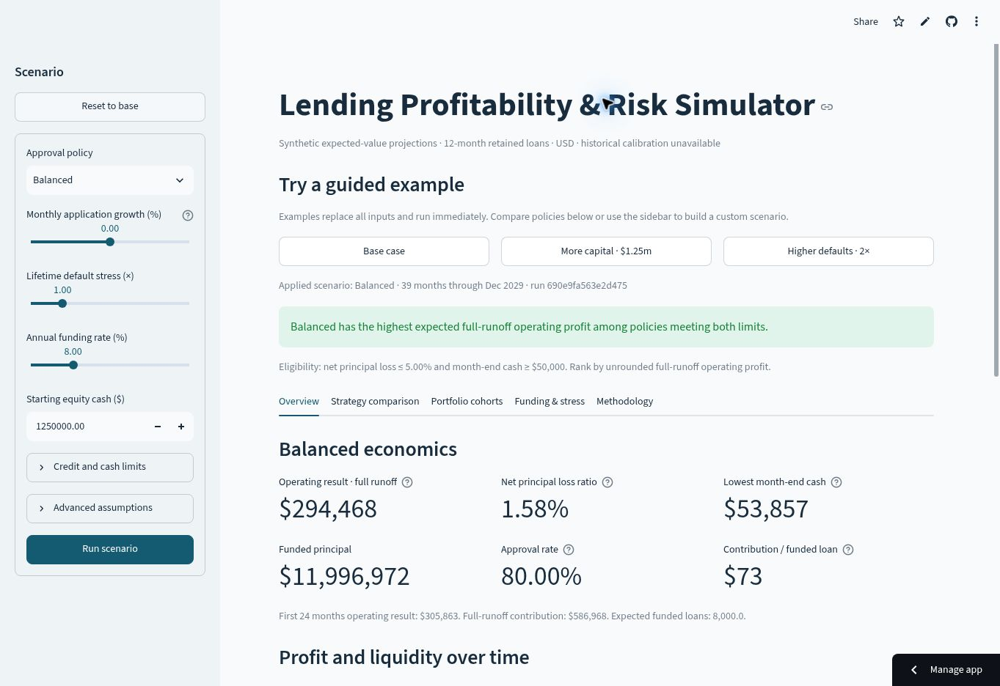

# Lending Profitability & Risk Simulator

Compare how expanding loan approvals changes credit losses, profit, debt use, and cash. A standalone portfolio project for fintech finance and credit/risk analysis, separate from the Financial Underwriting Tool.

The app models a hypothetical lender retaining 12-month merchant-financed installment loans. Its 10,000 applications and risk assumptions are **synthetic and illustrative**. Historical sources provide context only; this is an **uncalibrated expected-value simulator**.

**Live dashboard:** [Open the dashboard](https://rishabb-lending-simulator.streamlit.app/) · **Source code:** [main](https://github.com/rishabbshankar226/Lending-Profability-Risk-Simulator/tree/main) · **Merge history:** [PR #1](https://github.com/rishabbshankar226/Lending-Profability-Risk-Simulator/pull/1)

**Start here:** [Two-minute reviewer guide](docs/reviewer-guide.md) · [Application and interview notes](docs/interview-notes.md)

**Quick visual tour:** [90-second captioned screenshot video](docs/tour/lending-simulator-tour.mp4) · [Transcript and source captures](docs/tour/README.md). Six real dashboard screenshots, assembled with captions; no audio or continuous interaction recording.



## The decision

Choose the highest full-runoff management operating profit among three policies that meet a net principal loss cap and minimum month-end cash floor. Defaults: 5% net loss and $50,000 cash. No eligible or profitable policy means no profitable recommendation.

With $500,000 starting equity and a $2m facility, the base case demonstrates why profit alone is insufficient:

| Policy | Approval rate | Full-runoff operating profit | Net principal loss | Minimum cash | Eligible |
| --- | ---: | ---: | ---: | ---: | --- |
| Conservative | 45% | $48,133 | 0.84% | $147,450 | Yes |
| Balanced | 80% | $294,468 | 1.58% | −$696,143 | No: cash floor |
| Aggressive | 100% | $396,446 | 2.29% | −$1,485,855 | No: cash floor |

These are conditional modeled results, not observed lender performance. See the [business memo](docs/business-memo.md) and [saved base-case manifest](docs/base-case.json).

## Run locally

Use Python **3.12**. Direct dependency versions were installed and smoke-tested together.

```bash
python -m venv .venv
source .venv/bin/activate
python -m pip install -r requirements-dev.txt
python -m streamlit run app.py
```

On Windows, activate with `.venv\Scripts\activate`. Open the localhost URL printed by Streamlit. The app preloads the dataset and needs no upload, API key, or login.

```bash
python -m pytest
python -m lending_simulator.cli --output artifacts/base-case
python -m scripts.generate_dataset
```

The CLI produces three scenario workbooks, exact-value CSV packages, comparison metadata, and a workbook specification. Regeneration reproduces the committed application CSV and content hash.

The server test starts Streamlit on a temporary local port, checks HTTP health and the frontend document, then stops it. This verifies startup; it does not inspect browser rendering or interactions.

To reproduce downloaded inputs, unzip `manifest.json` and use:

```bash
python -m lending_simulator.cli --assumptions path/to/manifest.json --output artifacts/reproduced
```

## Explore the dashboard

Start with the decision panel above the tabs. **Recommended policy** compares all three policies; **Viewing policy** identifies the portfolio used by the metrics, charts and downloads. The panel shows full-runoff operating profit, the cash cushion or shortfall relative to the floor, and credit-loss headroom or excess in percentage points. Actual minimum cash, loss ratio and both limits remain visible. Applied inputs and the run identity stay tied to the last successful run while you edit the sidebar.

Then explore the one-click examples:

| Example | Selected policy | Change from base |
| --- | --- | --- |
| Base case | Conservative | Restore $500,000 equity and all base assumptions |
| More capital · $1.25m | Balanced | Set starting equity to $1.25m |
| Higher defaults · 2× | Conservative | Double lifetime default assumptions |

Each example replaces all inputs, runs immediately, restores the First 24 months cohort view and clears the old stress grid. Recommendations still compare all three policies using the model's rules.

1. **Overview:** selected-policy approvals, funded volume, unit contribution, and profit/cash over time. The decision panel remains above every view.
2. **Strategy comparison:** policy summaries show profit, minimum cash, net principal loss, eligibility and equity gaps together; charts and the detailed table use the same applied inputs.
3. **Portfolio cohorts:** projected loss by origination month and loan age; future ages remain blank at a cutoff.
4. **Funding & stress:** cash/debt, additional equity, and a default × funding-rate sensitivity grid.
5. **Methodology:** timing, assumptions, sources, financial checks, SQL, and run manifest.

Use **Run scenario** to apply custom sidebar edits. **Reset to base** restores all assumptions and the cohort cutoff. Downloads always use the applied scenario. Workbook portfolio sheets are saved snapshots; its independent loan and recovery benchmarks contain editable formulas.

Download **Decision brief** for a Markdown report with the calculated recommendation, selected portfolio, shared assumptions, policy tradeoffs and reproducible run manifest. **Preview decision brief** shows the same report in the app. Draft or invalid edits retain the last successful applied brief.

## How it works

| Layer | Files | Responsibility |
| --- | --- | --- |
| Dataset | `data.py`, `data/` | Immutable, validated seeded demand and provenance |
| SQL analytics | `analytics.py`, `queries/*.sql` | Correct policy denominators and cohort inputs in integer cents |
| Financial model | `model.py`, `types.py` | Pure expected-value repayment, defaults, recoveries, funding and cash |
| Decisions | `decisions.py` | Exact eligibility, ranking, ties, stress cases and honest empty/loss states |
| Presentation | `presentation.py`, `exports.py`, `app.py` | Charts and downloads from the same result bundle |

Finance uses 34-digit Decimal arithmetic with a $1e−16 internal reconciliation tolerance. Chart values and workbook snapshots use ordinary numeric display precision; CSVs retain exact Decimal strings. The operating view has 24 origination months; the default comparison runs 39 months through complete recovery runoff. No charge-off is subtracted as a second cash payment.

## Review and learn

- [Two-minute reviewer guide for finance and credit/risk roles](docs/reviewer-guide.md)
- [Project pitch, resume drafts and interview answer checkpoints](docs/interview-notes.md)
- [Model specification and assumptions](docs/model-spec.md)
- [Dataset dictionary and SQL walkthrough](docs/data-and-sql.md)
- [Historical source-fitness decision](docs/source-fitness.md)
- [Validation and measured limitations](docs/validation.md)
- [Base-case audit workbook](docs/audit-workbook.xlsx)
- Decision brief examples: [base](docs/base-decision-brief.md), [capital](docs/capital-decision-brief.md), [default stress](docs/default-stress-decision-brief.md)
- [Interview and 90-second demo walkthrough](docs/walkthrough.md)
- [Hosted review deployment](docs/deployment.md)
- [Live browser results and screenshots](docs/browser-validation.md)
- [Browser and release checklist](docs/release-checklist.md)

All 83 automated model, application-state, export, and HTTP startup checks pass. The decision panel adds coverage for recommendation versus viewed policy, cash/credit margins and exact boundaries, applied inputs through draft/invalid edits, empty portfolios and heading levels. The financial engine, model version and existing example run identities are unchanged. The local preview could not be reached by the cloud browser, so the new layout has not been visually or keyboard tested in a browser; desktop/mobile rendering remains to be verified.

The earlier hosted desktop build was exercised across all five tabs, scenario apply/reset, capital and stress cases, validation errors, cohort cutoffs, and downloads. Guided examples were checked for the correct applied runs, replacement of draft/advanced inputs, stress-grid clearing and keyboard activation. The three actual decision-brief downloads matched local regeneration exactly; the capital brief retained applied inputs during a draft edit, and its saved manifest reproduced the same CLI decision and run. The comparison summaries were verified at base and $1.25m starting equity. See the browser evidence for tested commits and run IDs. Missing or invalid base data stops the dashboard with a clear error; validated replacements refresh the applied scenario and exports.

PR #1 is merged into `main`, with passing GitHub checks. The live demo still uses `feature/lending-simulator`; that branch is retained for hosting and does not yet include the decision-panel upgrade. The existing screenshots and tour show that earlier build. Anonymous-session and mobile testing, a full accessibility/network audit, hosting load measurements, and a continuous interactive walkthrough recording remain pending. The hosting public setting was observed, but an isolated anonymous browser was unavailable.
