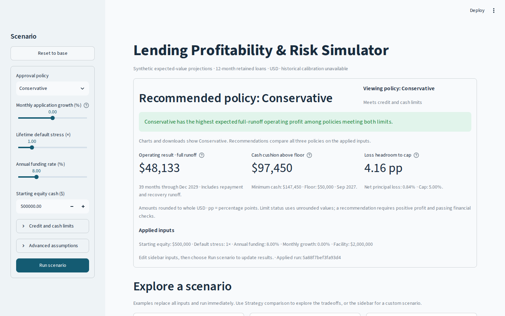
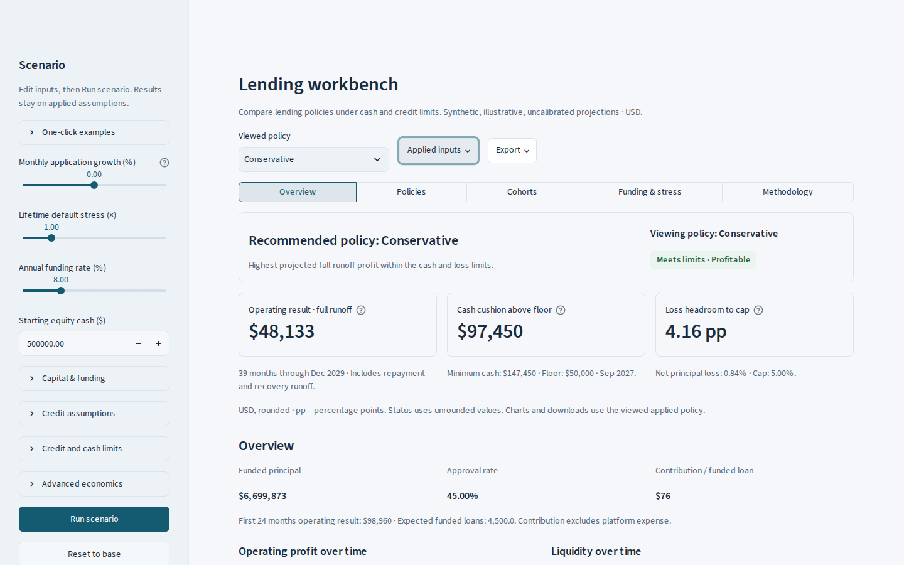
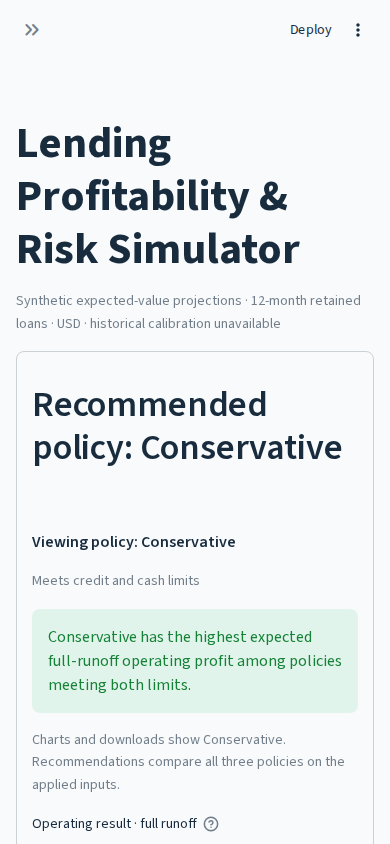
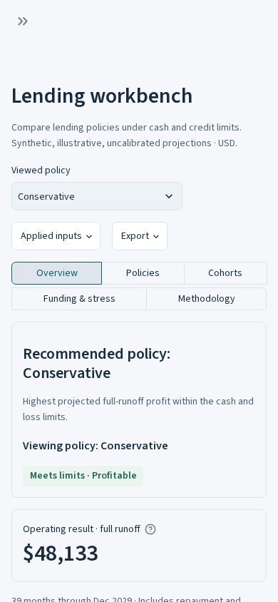

# Workbench browser validation

**October 10, 2026 (UTC) · candidate browser checks passed.** The redesigned application was exercised in real headless Chromium on an isolated GitHub Actions runner. This is rendered application evidence, separate from Streamlit AppTest and the previously hosted dashboard.

Tested application and automation checkout: `ba68ea38b4b09f38e6e0824906c2bc0de84efc19`. [CI run 38021305993](https://github.com/rishabbshankar226/Lending-Profability-Risk-Simulator/actions/runs/38021305993) passed **118 tests with no skips**, compilation, CLI generation, **14 browser journeys with 94 checks**, and two exact pre-redesign reference captures. The same application/UI/config hashes appear in all current acceptance reports: [nine normal journeys / 59 checks](workbench-browser-report.json), [two controlled export journeys / ten checks](workbench-export-resilience-report.json), and [accessibility plus two native zoom journeys / 25 checks](workbench-accessibility-report.json).

All 27 selected screenshots and the current raw reports were refreshed from this run. The financial engine, model version, dataset, SQL, exports and production dependencies still match the pre-redesign base. Later evidence/documentation commits retain these tested application sources.

## Method and scope

`scripts/browser_acceptance.py` starts the normal `app.py` entrypoint on a temporary loopback port and uses Playwright 1.58.0 with Chromium 145.0.7632.6. Each journey has a new browser context. Interactions use visible controls, keyboard actions and ordinary scrolling; DOM/chart inspection is read-only. Actual files are downloaded and opened. No hosting login, deployment or application-state injection is involved.

The empty-input journey runs a separate copy of the same app/code/config with a valid zero-row dataset and matching manifest. It exercises real validation and projections. Zero cash/facility inputs do not create an empty portfolio: the model retains negative-cash diagnostic lending paths, so they cannot substitute for that input case.

`scripts/browser_export_resilience.py` uses a separate test-only entrypoint for each case, with a fresh server/cache. It wraps only the CSV builder inside the real cached export: a file gate holds one builder call until policy selection completes, or the builder raises once before producing bytes. All successful files use the original builder, immutable applied results and normal Streamlit download path. The fixture never loads in the production app. It does not throttle network transfers or inject financial outputs/application state.

`scripts/browser_accessibility.py` opens every main-view detail section, reads Chrome's accessibility tree, checks main heading levels and exposed control names, and samples HTML text/input colors. It then opens all 18 financial editors and submits an invalid cash floor, checking the accessible alert, draft comparison, text contrast and retained applied metrics. Readable SQL and JSON manifests are compared with the complete original queries and saved reference values. Background sampling respects text position and enclosing scroll surfaces; closed/decorative content is excluded.

The two zoom journeys use full Chromium in separate temporary profiles. A test-only extension with loopback-only host permissions calls Chrome's automatic per-tab zoom through a visible helper control. Chrome reports 2× and approximately 4×; the CSS viewport shrinks from 1280 × 813 to **640 × 406** and **320 × 203**, with DPR 2 and 4 and visual viewport scale 1. All five views, settled chart layouts, hovered chart toolbars, typed input → Run, policy selection and a real identified brief download pass. Screenshots use the native compositor without a CSS-sized clip; each unedited PNG is checked against the CSS viewport × DPR and measures **1280 × 813**. This is native browser zoom, separate from the 390/320-pixel emulated-width cases.

The [reference capture report](workbench-reference-report.json) pins the exact pre-redesign base, `baeda884355734f534babd2bc73ab7018742569f`, in the same browser/dependency environment. Captures are raw screenshots. Streamlit scrolls the main area independently of the document, so screenshots show the recorded viewport and scroll position rather than a stitched whole application.

## Acceptance results

| Journey | Viewport | Observed result |
| --- | --- | --- |
| Desktop scenario flow | 1440 × 900 | Base identities; immediate typed edit → Run; recommendation/view distinction; draft navigation/restore; pinned 39/48-month comparison; cohort cutoff; exact stress staging/dirty guard; stale-grid clearing; defaults and invalid-input states; reconciliations. |
| Desktop reflow | 1280 × 800 | All five views; policy table; visible initial navigation; no measured main-area horizontal overflow. |
| Downloads | 1440 × 900 | Real Markdown, XLSX and ZIP; filenames and embedded run identities verified; preview and newly identified policy export. |
| Phone | 390 × 844 | Five views; wrapping navigation above the summary; policy cards; sidebar Run reachable; return to analysis; export controls reachable. |
| Narrow reflow | 320 × 800 | Same navigation/card/sidebar/export checks without measured horizontal overflow. |
| Keyboard | 1280 × 800 | Normal Tab path reaches Run, policy selection and analysis; Enter activates navigation; focus survives selection; popover opens/escapes and returns focus; visible outline; reduced-motion preference recognized. |
| Captured file across selection | 1440 × 900 | CSV requested under Conservative, saved after viewing Balanced; original filename/manifest retained. |
| Empty input source | 1440 × 900 | No eligible policy; unavailable loss headroom; empty cohorts; 20-case stress inspection keeps unavailable net loss distinct from zero. |
| Download cancellation/retry | 1440 × 900 | Chromium denies one actual download (`canceled`), then permits retry; applied metrics/run remain intact; retried ZIP manifest retains that run. |
| Held server generation | 1440 × 900 | Generating CSV control is disabled; Balanced renders with its new applied run while the original Conservative builder remains held; release downloads the original filename/manifest/bytes; a later download uses Balanced. |
| Server-generation failure/retry | 1440 × 900 | A fresh-cache CSV builder fails once; native inline error is visible and the same button becomes usable; no file downloads; retry clears the error and generates the correct applied ZIP; metrics and subsequent analysis remain intact. |
| Native semantics and HTML readability | 1440 × 900 | Five expanded views have one main h1 and no forward heading-level skips; exposed controls have names; all 18 financial inputs have names; invalid Run exposes a readable alert and preserves the applied result; complete SQL/manifest contents match their references. |
| Native 200% zoom | 640 × 406 CSS; 1280 × 813 compositor | Five views and hovered chart toolbars fit their measured bounds; enlarged inputs and selected-policy brief download work; Chrome confirms actual tab zoom. |
| Native 400% zoom | 320 × 203 CSS; 1280 × 813 compositor | The same reflow, toolbar, scenario identity and real-download checks pass with ordinary vertical scrolling. |

All 14 application contexts established Streamlit WebSockets. No browser warnings/errors or unexpected failed page requests were recorded. The deliberate download cancellation is a browser failure. The separate injected builder failure is recorded in the export report and expected Streamlit server log; it does not crash the app or change its applied results.

The generation gate records `started` → policy selection completed → `released` → `completed` in that order. The viewed Balanced result renders while the Conservative builder remains held, and the downloaded original file's SHA-256 matches the builder's generated bytes. These establish controlled overlap and identity; they are not export-performance or hosting benchmarks.

The five expanded views contribute **443 HTML text/input samples**. Open financial editors add a 211-sample inspection, and the invalid-input/draft-review state adds a 221-sample inspection; these include repeated elements. The minimum computed text contrast is **5.40:1**, above the 4.5:1 normal-text threshold. The native sidebar error measures **5.45:1** against its composited sidebar surface. A raster cross-check also confirmed readable error text after darkening it.

This is a scoped AX/heading/control-name and HTML style audit. It excludes SVG/chart/canvas text, disabled/decorative content and complete interaction/focus states. It does not establish screen-reader output, full WCAG compliance, cross-browser support or physical-device behavior. Full raw AX trees and color samples are retained in the Actions artifact; the repository report retains named checks, view summaries and financial-control names.

The browser retains full-resolution monthly chart data: 39 base months, a date axis and exact cash-floor reference. Stress axes explicitly retain percentage and multiplier categories. AppTest/pure-data tests additionally verify suppressed incompatible runoff deltas, future cohort blanks, common scales, exact applied stress markers, deferred per-format generation and captured immutable inputs.

## Defects found and corrected

| Finding from the rendered audit | Resulting change |
| --- | --- |
| Native captions applied inherited 0.6 opacity, weakening supporting text. | Escaped owned caption markup uses the muted text token at full opacity; rendered contrast is measured. |
| Phone navigation followed stacked metrics and long introductory content. | Compact title/copy and wrapping analysis controls before the decision summary; native minimal toolbar removes development controls. |
| Plotly inferred a numeric funding axis and dropped percent labels. | Explicit categorical stress axes; browser checks and a real chart capture verify `4.00%` through `16.00%`. |
| Opening Credit assumptions reran the app and could overwrite a quick edit before Run. | Keep the already-built credit controls client-side on expansion; the browser immediately types a recovery-lag edit and applies it, preserving the 39/48-month comparison. |
| Native static table headers rendered at 0.6 text alpha, below the normal-text threshold. | Public Pandas Styler applies the opaque muted color and medium weight to native row/column headers, including draft review; table values and behavior remain native. |
| The source-fitness warning and SQL/JSON syntax colors weakened readability. | Darker supported warning text, and wrapped plain monospace SQL/manifests with native copying; complete reference content is checked in the browser. |
| Sidebar validation text was readable on a white assumption but fell to about 4.04:1 on the actual sidebar error surface. | Supported red text color uses the existing dark error token; the corrected scroll-surface probe measures 5.45:1 and the pixel cross-check passes 4.5:1. |

The audit also corrected test setup rather than weakening expectations: native radio labels are clicked rather than their covered inputs; dropdown opening waits for settled rendering; zero financing was replaced with a genuine empty dataset. Request interception affected Streamlit's source-URL check rather than the actual download. It was removed from the transport claim and replaced with native download cancellation and file-identity checks.

Final integration checks exposed another test synchronization issue in [CI run 40](https://github.com/rishabbshankar226/Lending-Profability-Risk-Simulator/actions/runs/38022798343). Its desktop trace shows the example section already marked open but still locked to 40 pixels with hidden overflow; the automated child click occurred during the reveal and missed Higher defaults. The browser helper now waits for the section's natural height and finished animations before interacting with its children. The same heading, financial values and exact run-identity assertions remain in place. Application and financial sources are unchanged by this test correction.

The new audit was also checked against its own measurements. Slider labels sit above their colored thumbs; sampling the thumb as their background created a false contrast failure. Closed detail charts and unsettled resize measurements created a false overflow failure. Native 4× zoom is reported as `3.9999999999999996`, so the check uses numeric tolerance. Explicitly opened details, spatial/scroll-background sampling, settled plots and hovered toolbars now test the real rendered states. The initially clipped zoom screenshots were replaced with unclipped compositor captures and pixel-dimension assertions. [The evidence manifest](workbench-evidence.json) retains diagnostic run identities and these corrections.

## Before and after

| Exact pre-redesign base | Workbench candidate |
| --- | --- |
|  |  |
|  |  |

Additional actual captures: [profit and liquidity timelines](screenshots/workbench/desktop-1440-overview-charts.png), [invalid-input message](screenshots/workbench/desktop-1440-invalid-input.png), [policy table](screenshots/workbench/desktop-1440-policy-table.png), [phone policy cards](screenshots/workbench/phone-390-policy-comparison.png), [profit bridge](screenshots/workbench/desktop-1440-profit-bridge-chart.png), [different runoff](screenshots/workbench/desktop-1440-runoff-comparison.png), [cohort chart](screenshots/workbench/desktop-1440-cohort-chart.png), [staged stress](screenshots/workbench/desktop-1440-stress-chart.png), [loss-making warning](screenshots/workbench/desktop-1440-higher-defaults.png), [empty stress loss](screenshots/workbench/empty-portfolio-stress.png). The [evidence manifest](workbench-evidence.json) retains hashes and source identities.

Export follow-up captures: [generating control](screenshots/workbench/slow-generation-generating.png), [changed policy while generation remains held](screenshots/workbench/slow-generation-changed-policy-while-generating.png), [inline generation error](screenshots/workbench/generation-retry-generation-error.png). All 27 saved images are unedited browser captures; the three export images document the explicitly instrumented test cases. Normal application, export and reference captures were refreshed alongside the new audit images.

Readability captures: [profit table](screenshots/workbench/accessibility-profit-table.png), [manifest](screenshots/workbench/accessibility-methodology-manifest.png), [SQL](screenshots/workbench/accessibility-methodology-sql.png), [invalid alert and draft comparison](screenshots/workbench/accessibility-invalid-input-alert.png).

Native zoom captures: [200% Overview](screenshots/workbench/zoom-200-overview.png), [200% Policies](screenshots/workbench/zoom-200-policies.png), [200% Export](screenshots/workbench/zoom-200-export.png), [400% Overview](screenshots/workbench/zoom-400-overview.png), [400% Policies](screenshots/workbench/zoom-400-policies.png), [400% Export](screenshots/workbench/zoom-400-export.png). Streamlit's independently scrolling main area means these show the actual viewport and scroll position, with ordinary vertical scrolling required at high zoom.

## Remaining release checks

- Human visual review, physical phone/iOS behavior, actual screen-reader output and a complete native-widget/focus/contrast audit across interaction states and browsers. Native 200%/400% Chrome zoom now passes the scoped software journeys. Mobile sizes here are Chromium emulation; the phone journeys verify control access rather than hardware numeric-keyboard use.
- Actual candidate-host source/access checks, anonymous public access, cold/warm hosting latency, wake behavior and sustained multi-user load. Loopback navigation timings in the report are individual samples including automation waits; they are not hosting latency or p95.
- Hosted export failures and slow network transfers have not been exercised. Controlled slow server generation, selection overlap and uncached generation failure/retry now pass; the earlier loopback captured-file check alone is still not used as proof of an in-flight transfer.

The owner approved merging the redesign into `main` on October 10, 2026 (UTC); [PR #4](https://github.com/rishabbshankar226/Lending-Profability-Risk-Simulator/pull/4) records the source integration. Hosting rollout remains separate. The previously verified public build and existing tour use the earlier hosting branch; this PR does not change its hosting source. The software evidence above does not establish the remaining public-release checks.
